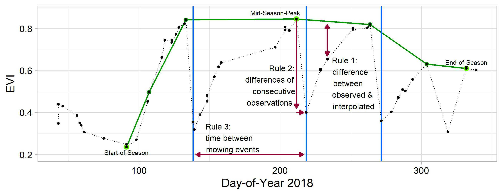
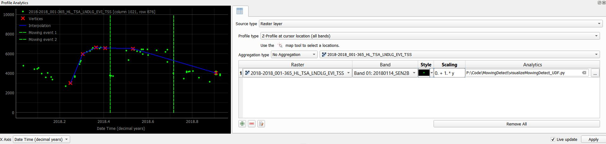

# Mowing detection

&copy;
Copyright 2021 Marcel Schwieder and Max Wesemeyer

This algorithm was developed to estimate mowing events on grasslands from dense vegetation index time series derived from Sentinel-2 and Landsat data.
It was developed and tested for grasslands in Germany (see maps here: https://ows.geo.hu-berlin.de/webviewer/mowing-detection/).
While the thresholds used to identify mowing events are derived from the time series itself, some parameters might be adjusted for your specific 
use case. Details regarding the indivídual processing steps are described in the Schwieder et al. 2021 (open accesss).

# Output
The algorithm is pixel based. The output is a raster stack with 17 bands that contain:

- B1: Sum of mowing events
- B2: Maximum data gap in original time series
- B3: absolute clear sky observations (CSO)
- B4: CSO/potential observations (*100)
- B5 - B11: DOY of detected mowing events
- B12: Mean VI value of the defined grassland season
- B13: Median VI value of the defined grassland season
- B14: VI standard deviation of the defined grassland season
- B15: Sum of differences between interpolated and original values (*100)
- B16: Sum of differences between interpolated and original values * data availability (*100)
- B17: Processing error [0,1]

## Usage 

Run with the FORCE higher-level module and the TSA parameter file. Choose a vegetation index of your choice (tested with EVI and NDVI).
Make sure not to output TSI unless you do not want to analyze the original time series.
It is recommended to not use the above und below noise filters (FORCE TSA), as they might filter out potential mowing events.

- program: ``force-higher-level``
- submodule: ``TSA``
- UDF type: ``PYTHON_TYPE = PIXEL``
- required parameters: ``none``
- suggested parameters: ``INTERPOLATE = NONE, BELOW_NOISE = 0, ABOVE_NOISE = 0``
- required Python libraries: ``numpy, scipy``

The following parameters might be changed in the mowingDetection.py UDF (search for the function: detectMow_S2_new):
- GLstart and GLend (defines the approximate length of grassland season in which you expect the main mowing activity; make sure too include a buffer)
- PSstart and PSend (defines the approximate length of the main vegetation season; i.e., time of the year in which you expect at least one peak)
- GFstd and posEval (sensitivity of thresholds; i.e., width of gaussian function and number of positive evaluations)

## Visualization

You can visualize the pixelwise results of the mowingDetection_UDF using the QGIS-Plugin Profile Analytics which comes with the installation of the EnMAP-Box Plugin 
(van der Linden et al., 2015; implemented since v.3.12-alpha.2; tested in QGIS 3.26; further details: https://enmap-box.readthedocs.io/en/latest/usr_section/usr_manual/eo4q.html?highlight=profile#profile-analytics).

Please save a local copy of the UDF and make sure to set ``profileAnalytics = True`` in the main code. Additionally you need to set an environmental variable in QGIS
following this example: 

Settings --> Options --> System --> Environment: ``Apply = Append`` | ``Variable = PYTHONPATH`` | ``Value = ;PATH\TO\mowingDetection_UDF.py``
(Note: Make sure to set the correct separator for appended variables (before the defined path) according to your system; here ";")

Finally you need to download /force-udf/pyhton/ts/mowingDetection/visualize_mowingDetection_UDF.py and prompt to this file in the Profile Analytics GUI.
Choose a FORCE TSS output file (vegetation index of your choice) as raster input and set the x-axis to Date Time (decimal years) in the Profile Analytics GUI. Once you
click a pixel with the "Select current location" tool the vegetation index time series will be visualized along with the results of the mowingDetection_UDF. You can now 
adjust parameters in the main code and directly investigate the impacts of your changes. Printouts can be checked in the QGIS Python console.

## References

- Schwieder, M., Wesemeyer, M., Frantz, D., Pfoch, K., Erasmi, S., Pickert, J., Nendel, C., & Hostert, P. (2022). Mapping grassland mowing events across Germany based on combined Sentinel-2 and Landsat 8 time series. Remote Sensing of Environment, 269, 112795.
- van der Linden, S., Rabe, A., Held, M., Jakimow, B., Leitão, P.J., Okujeni, A., Schwieder, M., Suess, S., & Hostert, P. (2015). The EnMAP-Box—A Toolbox and Application Programming Interface for EnMAP Data Processing. Remote Sensing, 7, 11249-11266.

